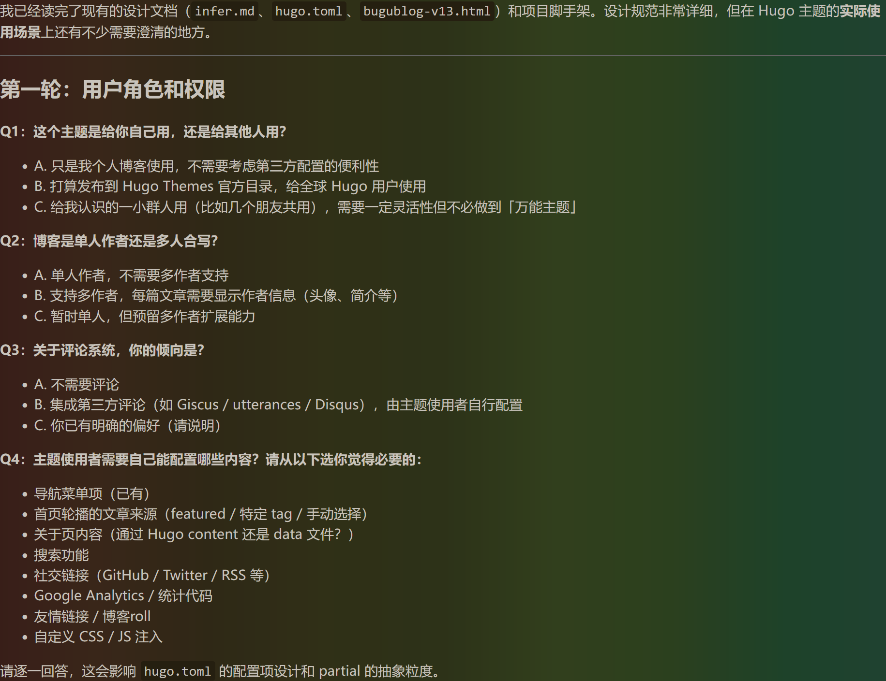
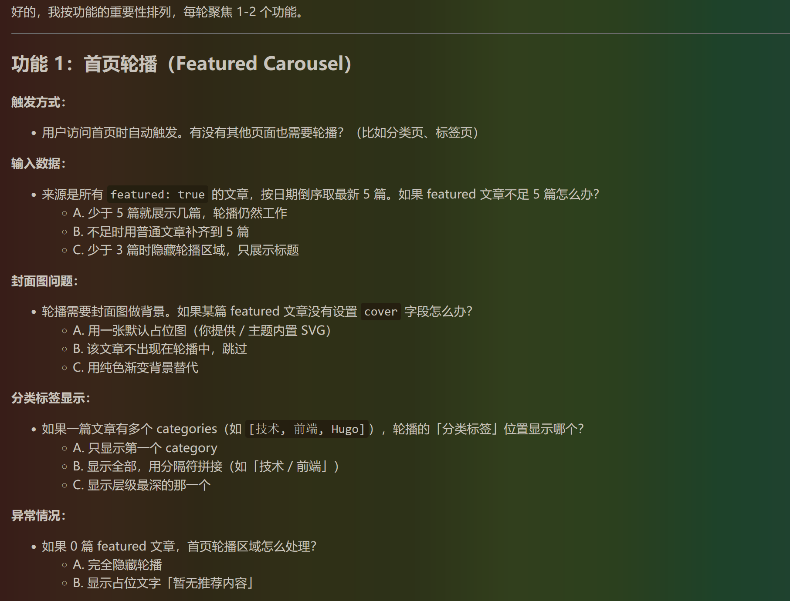

+++
title = 'VibeCoding手记'
date = '2026-05-26T22:17:01+08:00'
description = ''
subtitle = '把虚无缥缈的氛围，变成触手可及的产物'
featured = false          # show in carousel
categories = ['学习', 'AI']
tags = ['AI', '开发']
cover = 'cover.png'      # image in the same directory, or external URL
toc = true               # show table of contents sidebar
draft = false

+++

## 前言

从去年 Claude Code 发布开始，Vibe Coding 的发展速度就令我震惊，让刚工作的我感受到了大大的危机，毕竟 AI 写的代码质量越来越高，效率也越来越快了。但是 AI 现阶段毕竟还只是工具，与其跟工具比力气，不如直接上手用。之前我在使用中都只是让它做一个具体的功能，在现有的框架下修修改改；而最近，我开始尝试让 AI 从零开始做一个项目，本篇文章就是我最近所做的一个总结。

本篇文章的思路实际上是对[LinuxDo](https://linux.do/) 上一位贴主分享的一次实践，在这里也对这位贴主表示非常感谢！

## 使用工具与模型

+ Claude Code
+ DeepSeek V4 Pro ~~不用Claude不是因为我穷！~~

*注：这次实践中Claude Code中没有使用任何SKILL。*

## Phase 1：需求定义

在进行一个完整项目的开发前，需要确定这个项目究竟要做什么、要实现什么效果。**这一点在后续的 AI 开发中显得尤为重要**，因为 AI 的上下文是有限的。我使用的 DeepSeek V4 Pro 拥有 1M 的上下文，在国产模型中已经是最大的了，但在实际开发中还是捉襟见肘。而需求文档则可以在 AI 忘记之前的内容时，**提醒它**我们项目的开发方向，不至于让它“胡思乱想”。当然，**需求文档自然也是**交给 AI 来生成啦。

### Step 1.1：需求探索对话

**第一轮 —— 项目概述**

AI擅长的就是对话，所以我们就在与AI的话疗中确定需求。用以下提示词开始多轮对话，逐步细化需求：

```markdown
我要开发一个 [项目类型，如：Hugo博客主题]。

请反复问我问题，直到你完全理解我的需求。不要猜测，直接问。

我的初步想法：
- 目标用户：[描述目标用户]
- 核心问题：[这个产品解决什么问题]
- 关键功能：[列出你最想要的 3-5 个核心功能]

请从以下维度逐一问我问题：
1. 用户角色和权限
2. 核心业务流程
3. 数据模型
4. 界面交互
5. 非功能性需求（性能、安全等）

每轮只问 3-5 个最关键的问题，等我回答后再继续。
```

在第一步中我们只需要提出最关键的需求即可，剩下的交给AI来做。下面的图是AI的根据提示给出的问题，而你只需要跟着回答就行了。



我的回答是这样的，只需要进行若干轮次的问答，AI就可以确定你的大致需求了，值得一提的是在问答的过程他提出的问题很多都是我没有思考过的。 我还是太菜了

```markdown
Q1:自己用 Q2:单人作者 Q3:集成Disqus Q4:导航栏菜单、搜索、关于页通过Hugo content、首页轮播内容手动选择、社交链接、GOOGLE Aanlytics、友情链接
```

**第二轮 —— 细化核心功能**

在得到大致的需求后，我们可以进行第二轮问答来细化核心功能。我们向AI做出如下指示：

```markdown
现在针对核心功能进行细化。请逐一问我关于以下每个功能的具体细节：

[功能1名称]：
- 用户如何触发这个功能？
- 输入什么数据？
- 预期输出什么？
- 有哪些异常情况需要处理？
- 有没有权限限制？
```

让我们来看一下AI的回复以及我的回答



```markdown
功能一： 只有首页触发轮播图，自动触发 输入数据：A 分类标签显示：最多展示三个（按顺序），每个标签都使用一个tag容器 异常状况：隐藏轮播图
```

很好，可以看出AI提出了更加具体的功能需求，只需要继续这样的对话，整个项目需求文档基本就确定了。

**第三轮 —— 边界条件和约束**

这是最后一步了，完成这一步之后即可定稿需求文档了。让我们问AI：

```markdown
请帮我梳理边界条件和约束：

1. 哪些操作需要确认/撤销？
2. 数据量级预估（用户数、数据条数）？
3. 哪些场景需要 loading 状态？
4. 哪些场景需要错误提示？
5. 有没有特殊的合规/安全要求？
6. 移动端是否需要适配？
7. 是否需要国际化？
8. 是否需要暗色模式？
```

回答完这一轮后，告诉AI生成需求文档：

```markdown
基于我们以上的讨论，请生成一份完整的需求文档，保存为 docs/requirements.md。

文档结构要求：

# [项目名称] 需求文档

## 1. 项目概述
- 项目背景
- 目标用户
- 核心价值

## 2. 功能需求
### 2.1 [功能模块1]
- 功能描述
- 用户操作流程
- 输入/输出
- 异常处理
- 优先级（P0/P1/P2）

### 2.2 [功能模块2]
...

## 3. 非功能需求
- 性能要求
- 安全要求
- 兼容性要求
- 可用性要求

## 4. 用户角色与权限
## 5. 数据实体关系（初步）
## 6. UI/UX 概要
## 7. 里程碑与优先级

请写入 docs/requirements.md 文件。
```

很好，讨论到这里我还没有遇到AI忘掉之前讨论的情况，也没有触发CLAUDE CODE自动压缩上下文的情况，所以AI的记忆力是足以支持起一个完整项目的需求讨论环节的。最后，让我们再检查一下需求文档吧。

```markdown
请逐条确认以上需求文档中是否有：
1. 描述模糊或歧义的地方
2. 功能之间的逻辑冲突
3. 遗漏的关键场景

如有，请直接修改 docs/requirements.md。
确认无误后，告诉我「需求文档已定稿」。
```

这一步还是有必要的，因为我在需求问答的时候，有几个点提出冲突的想法，在这一步中也会检查出一部分。最后分享一下我最终定稿的需求文档，比较长。



# 不孤·博客 (Bugublog) Hugo 主题 — 需求文档

## 1. 项目概述

### 项目背景
开发一个名为「不孤·博客」的 Hugo 主题，用于搭建个人文学博客。主题气质定位为「深夜海岸边的个人文学博客」——安静、克制、文字优先，视觉为阅读服务。

### 目标用户
- **主要用户**：主题开发者本人，单人使用，不需要面向第三方的高度可配置性
- **博客读者**：访问博客的普通用户，需要良好的阅读体验

### 核心价值
- **响应式**：桌面端、平板、移动端均有良好布局
- **易于阅读**：衬线标题 + 无衬线正文，高行高，舒适的字号层级
- **SEO 良好**：结构化数据、OG/Twitter Card、sitemap、canonical URL 全覆盖
- **易于维护**：Tailwind CSS v4 工具类优先，Hugo 标准模板结构，CSS 变量管理色彩系统

---

## 2. 功能需求

### 2.1 首页轮播（Featured Carousel）
**优先级**：P0

| 维度     | 说明                                                         |
| -------- | ------------------------------------------------------------ |
| 功能描述 | 首页顶部全宽轮播，展示精选推荐文章                           |
| 触发方式 | 用户访问首页自动触发，仅首页有轮播                           |
| 数据来源 | `featured: true` 且非 draft 的文章，按日期倒序取最新 5 篇。这 5 篇文章**不**在下方瀑布流中重复出现，首页瀑布流自动跳过已在轮播中的文章 |
| 自动播放 | 5 秒间隔，hover 时暂停，离开恢复                             |
| 触摸交互 | 移动端支持触摸滑动（阈值 50px）                              |
| 视觉规格 | 宽高比 16:7，最小高度 340px；≤720px 时比例改为 4:3           |
| 封面图   | 图片作为氛围背景（object-fit: cover），覆盖渐变层（底部黑色实色 → 中部半透明 → 顶部全透明） |
| 文字内容 | 分类标签（按 frontmatter 顺序取前 3 个 categories，各自独立 `<span>` 容器）+ 标题（Noto Serif SC，2.2rem）+ 日期·阅读时间 |
| 指示器   | 底部居中圆点，当前项拉长为 26px 胶囊形                       |
| 左右箭头 | hover 时显示，毛玻璃背景                                     |
| 装饰     | 右上角 50px 双层圆环（半透明白色）                           |

**异常处理**：
- 不足 5 篇 featured 文章：有几篇展示几篇，轮播仍工作
- 0 篇 featured 文章：完全隐藏轮播区域
- 文章无 `cover` 字段：使用纯色渐变背景替代（`linear-gradient(135deg, #5b6c7e 0%, #3a4a5c 100%)`，即点缀色 → 深蓝灰），覆盖整个轮播区域

---

### 2.2 文章卡片瀑布流
**优先级**：P0

| 维度         | 说明                                                         |
| ------------ | ------------------------------------------------------------ |
| 功能描述     | 首页及分类/标签页的文章卡片展示，CSS columns 瀑布流布局      |
| 布局         | 桌面 2 列（column-gap: 24px），≤720px 1 列，≥1400px 列间距扩大到 28px |
| 卡片结构     | 封面图 + 分类标签（前缀横线）+ 标题（1.18rem，Noto Serif SC）+ 摘要（2 行截断）+ 日期·阅读时间 |
| 角线设计     | 左上/右下各有 2.5px 粗蓝灰直角线（24px × 24px），使用 ::before/::after 实现，必须在卡片边界内部 |
| Hover 效果   | 上浮 3px + 阴影加深 + 边框加深 + 角线扩大到 30px             |
| 分页方式     | 无限滚动（滚动到底部自动加载，每次加载 6 篇）。Hugo 构建时除了生成 HTML 分页外，额外生成 `/posts.json`（outputFormat 自定义 JSON），包含全部非 draft 文章的 title/date/description/cover/categories/slug/readingTime。前端滚动到底部时，从已加载的 JSON 中取出下一批 6 篇，客户端渲染卡片 DOM 并插入瀑布流容器 |
| 初始加载量   | 首页首屏加载 12 篇（前 2 批），后续每次无限滚动加载 6 篇     |
| 加载完成处理 | 全部文章加载完毕后，不再触发加载，无额外提示                 |
| 新卡片动画   | 渐显 + 上移动画进入                                          |

---

### 2.3 文章详情页
**优先级**：P0

| 维度       | 说明                                                         |
| ---------- | ------------------------------------------------------------ |
| 功能描述   | 单篇文章的阅读页面                                           |
| 布局       | 限宽 680px 居中                                              |
| 顶部元素   | 返回链接「← 返回文章列表」，位于标题上方。该链接在分类/标签页来源时指向对应分类/标签列表；在无来源上下文时指向 `/posts` |
| 封面图     | 4px 圆角，带阴影                                             |
| 分类标签   | 文章所属 categories 全部展示，每个用前缀 em-dash「—」的独立容器 |
| 标签展示   | 文章底部（评论区上方）展示所有 tags，用小号标签样式（浅蓝灰底色，无边框） |
| 标题       | 2.1rem Noto Serif SC                                         |
| 元信息     | 日期 · 阅读时间，底部分隔线                                  |
| 正文       | 1.02rem，行高 1.9；首段略大（1.12rem）                       |
| Blockquote | 左侧 3px 蓝灰竖线，浅蓝灰底色，装饰性大引号，衬线斜体        |
| H2 标题    | 文字 + 右侧填充横线（flex + ::after）                        |
| 图片       | 灯箱 + 懒加载（参见 2.5）                                    |
| 代码块     | Chroma 语法高亮 + CSS 变量自定义                             |
| 评论       | Disqus（参见 2.7）                                           |
| TOC        | 参见 2.4                                                     |

---

### 2.4 文章目录（Table of Contents）
**优先级**：P1

| 维度     | 说明                                                   |
| -------- | ------------------------------------------------------ |
| 功能描述 | 文章右侧固定目录，从 Markdown 标题自动生成             |
| 标题级别 | h2 和 h3                                               |
| 显示条件 | 桌面端大屏（≥1200px）在正文右侧固定；窄屏隐藏          |
| 滚动追踪 | Intersection Observer 追踪当前阅读位置，高亮对应目录项 |
| 点击行为 | 平滑滚动到对应标题                                     |

---

### 2.5 图片灯箱 + 懒加载
**优先级**：P1

| 维度     | 说明                                                         |
| -------- | ------------------------------------------------------------ |
| 功能描述 | 文章内图片点击放大浏览，加载时使用懒加载                     |
| 灯箱触发 | 点击文章正文中的图片 → 全屏灯箱模态，从被点击的那张图开始显示 |
| 灯箱交互 | 左右切换（同篇文章所有 `` 之间导航）、键盘操作（Esc 关闭，← → 切换）、点击遮罩关闭、双指/滚轮缩放 |
| 懒加载   | Intersection Observer + 淡入动画                             |

---

### 2.6 搜索
**优先级**：P1

| 维度     | 说明                                                         |
| -------- | ------------------------------------------------------------ |
| 功能描述 | 客户端全文搜索，Fuse.js 实现                                 |
| 触发方式 | 点击导航栏搜索图标 → 弹出搜索模态框                          |
| 索引构建 | Hugo 构建时生成 `index.json`，前端加载后由 Fuse.js 索引      |
| 搜索范围 | title + description + content + categories                   |
| 搜索算法 | Fuse.js 模糊匹配                                             |
| 索引加载 | 用户点击搜索图标时才开始加载 `index.json`（避免阻塞首屏），加载期间显示 loading 状态。index.json 由 Hugo 自定义 outputFormat 在构建时生成，仅包含非 draft 文章 |
| 结果展示 | 标题 + 匹配片段高亮 + 日期                                   |

**异常处理**：
- 输入为空：显示「请输入搜索关键词」
- 无匹配结果：显示「未找到相关内容」
- 索引加载中：显示 loading 状态
- 大量文章（500+）：暂不考虑，后续优化

---

### 2.7 评论系统（Disqus）
**优先级**：P2

| 维度     | 说明                                     |
| -------- | ---------------------------------------- |
| 功能描述 | 文章详情页底部 Disqus 评论               |
| 显示页面 | 仅文章详情页                             |
| 配置方式 | `hugo.toml` 的 `params.disqusShortname`  |
| 加载策略 | Intersection Observer 滚动到评论区再加载 |
| 异常处理 | shortname 未配置时完全隐藏评论区         |

---

### 2.8 关于页（About）
**优先级**：P1

| 维度     | 说明                                                         |
| -------- | ------------------------------------------------------------ |
| 功能描述 | 博主个人介绍页面                                             |
| 内容来源 | `content/about/index.md`，头像为 page resource               |
| 页面结构 | 圆形头像（90px，边框，hover 蓝灰光晕）+ 博客名 + 一句话介绍 + 个人简介正文 + 社交链接 |
| 布局     | 限宽 540px 居中，左侧对齐                                    |
| 社交链接 | GitHub、Twitter/X、邮箱，从当前页 frontmatter 字段 `github`、`twitter`、`email` 读取 |

---

### 2.9 友情链接 / 博客roll
**优先级**：P2

| 维度     | 说明                 |
| -------- | -------------------- |
| 功能描述 | 展示友情博客链接列表 |
| 数据来源 | `data/friends.yaml`  |
| 字段     | URL、名称、头像      |
| 展示位置 | 独立 `/friends` 页面 |

---

### 2.10 分类体系（Categories + Tags）
**优先级**：P0

| 维度        | 说明                                                         |
| ----------- | ------------------------------------------------------------ |
| 功能描述    | 双分类体系，文章可按 categories 和 tags 归类                 |
| Categories  | 层级分类，适合大类归类（如「技术」「生活」「读书笔记」）     |
| Tags        | 扁平标签，适合细粒度标注                                     |
| 分类/标签页 | 与首页相同的卡片瀑布流布局（无轮播），按当前分类/标签筛选    |
| 导航入口    | 导航菜单中「分类」链接到 `/categories`，「标签」链接到 `/tags` |

---

### 2.11 导航菜单
**优先级**：P0

| 维度       | 说明                                                         |
| ---------- | ------------------------------------------------------------ |
| 功能描述   | 全站顶部导航栏                                               |
| 菜单项     | 首页 / 文章 / 分类 / 标签 / 关于 / 友情链接                  |
| 配置方式   | Hugo 标准 menus 配置                                         |
| 激活态     | 当前页面对应导航项底部出现 4px 圆形蓝灰小点                  |
| 移动端导航 | ≤720px 时，导航链接折叠为汉堡菜单图标，点击展开垂直下拉菜单；搜索图标和 toggle switch 保持在 Header 右侧可见 |
| 附加元素   | 右侧搜索图标 + 深浅模式切换开关                              |

---

### 2.12 暗色模式切换
**优先级**：P1

| 维度     | 说明                                                         |
| -------- | ------------------------------------------------------------ |
| 功能描述 | 浅色/深色模式切换                                            |
| 默认模式 | 无 localStorage 记录时，检测 `prefers-color-scheme` 系统偏好；系统无偏好时默认浅色 |
| 切换控件 | Header 右侧 toggle switch                                    |
| 实现方式 | `<html data-theme="light|dark">` + CSS 变量                  |
| 持久化   | localStorage key `bugublog-theme`，用户手动切换后覆盖系统偏好 |
| 初始渲染 | `<head>` 中内联一段同步 JS（阻断渲染），在页面绘制前从 localStorage 读取并设置 `data-theme`，避免深色→浅色的闪烁 |

---

### 2.13 Google Analytics
**优先级**：P2

| 维度     | 说明                                    |
| -------- | --------------------------------------- |
| 功能描述 | 网站访问统计分析                        |
| 配置方式 | `hugo.toml` 的 `params.googleAnalytics` |
| 加载方式 | 直接加载 GA script                      |
| 异常处理 | ID 未配置时不输出 GA 代码               |

---

### 2.14 Footer
**优先级**：P1

| 维度     | 说明                                               |
| -------- | -------------------------------------------------- |
| 功能描述 | 全站底部区域                                       |
| 内容     | 博客标语 + 备案号（可选）                          |
| 配置方式 | `hugo.toml` 的 `params.footerText` 和 `params.icp` |
| 视觉     | 细线分隔，文字居中，前缀 6px 蓝灰小圆点装饰        |
| 社交链接 | Footer 中展示 GitHub/Twitter/Email 小图标          |

---

### 2.15 404 页面
**优先级**：P2

| 维度     | 说明                                             |
| -------- | ------------------------------------------------ |
| 功能描述 | 自定义 404 错误页面                              |
| 内容     | 搜索框 + 返回首页链接 + 与主题风格一致的氛围设计 |
| 风格要求 | 与整个网站主题风格一致                           |

---

### 2.16 页面切换动画
**优先级**：P2

| 维度     | 说明                                                    |
| -------- | ------------------------------------------------------- |
| 功能描述 | 页面加载时的过渡动画                                    |
| 实现方式 | CSS animation（首次加载内容淡入上移），每次页面刷新触发 |
| 参数     | 0.4s 上移淡入                                           |

---

### 2.17 社交链接
**优先级**：P1

| 维度     | 说明                           |
| -------- | ------------------------------ |
| 功能描述 | 展示博主的社交平台链接         |
| 平台     | GitHub、Twitter/X、Email       |
| 展示位置 | Footer 底部                    |
| 数据来源 | `hugo.toml` 的 `params.social` |

---

### 2.18 Frontmatter 模型
**优先级**：P0

每篇文章支持的 frontmatter 字段：

| 字段          | 类型     | 必填 | 说明                           |
| ------------- | -------- | ---- | ------------------------------ |
| `title`       | string   | ✅    | 文章标题                       |
| `date`        | datetime | ✅    | 发布日期                       |
| `lastmod`     | datetime | ❌    | 最后修改日期                   |
| `description` | string   | ❌    | 手动撰写的摘要                 |
| `featured`    | bool     | ❌    | 是否入选首页轮播（默认 false） |
| `categories`  | []string | ❌    | 多分类                         |
| `tags`        | []string | ❌    | 多标签                         |
| `cover`       | string   | ❌    | 封面图路径                     |
| `draft`       | bool     | ❌    | 草稿状态                       |

---

## 3. 非功能需求

### 3.1 性能要求
| 指标                   | 目标                                           |
| ---------------------- | ---------------------------------------------- |
| Lighthouse Performance | ≥ 95                                           |
| First Contentful Paint | < 2s                                           |
| 构建产物               | Tailwind CSS 摇树优化，无冗余样式              |
| JS 体积                | Fuse.js + 灯箱 + 轮播 各自按需加载，不阻塞首屏 |
| 字体加载               | Web font 使用 `font-display: swap`，避免 FOIT  |

### 3.2 安全要求
- Disqus 评论使用官方嵌入代码，不引入自定义 XSS 风险
- Google Analytics 使用官方 gtag script
- 搜索索引不暴露草稿（draft: true）文章
- 无用户输入提交，无服务端攻击面

### 3.3 兼容性要求
| 浏览器  | 最低版本        |
| ------- | --------------- |
| Chrome  | 最新 2 个大版本 |
| Firefox | 最新 2 个大版本 |
| Safari  | 最新 2 个大版本 |
| Edge    | 最新 2 个大版本 |
| IE11    | 不兼容          |

### 3.4 可用性要求
- 所有交互元素（按钮、链接、开关）有清晰的 hover/focus 状态
- 键盘可操作关键交互（搜索、灯箱、轮播）
- 图片提供 alt 文本
- 移动端触摸目标 ≥ 44×44px
- 颜色对比度满足 WCAG AA 标准

### 3.5 SEO 要求
- Open Graph 标签（全页面）
- Twitter Card 标签（全页面）
- JSON-LD 结构化数据（文章页：Article schema；全站：WebSite schema with SearchAction）
- XML Sitemap（Hugo 默认生成）
- Canonical URL（全页面）
- 语义化 HTML5 标签（`<article>`、`<nav>`、`<section>`、`<time>`、`<header>`、`<footer>`）

### 3.6 代码质量要求
- JavaScript：JSDoc 注解所有函数和模块
- CSS：工具类优先，`@apply` 少用；自定义样式放在 `assets/css/components/`
- Hugo 模板：使用 Go template 语法，partial 按职责拆分
- HTML 注释使用章节标记（`<!-- header -->` 等），避免泄漏到生产

---

## 4. 用户角色与权限

| 角色                    | 说明                                                         |
| ----------------------- | ------------------------------------------------------------ |
| **博客作者（Owner）**   | 唯一内容生产者。撰写文章、管理分类标签、维护友情链接和关于页。通过 Git + Hugo CLI 发布内容。 |
| **博客读者（Visitor）** | 访问网站浏览内容的匿名用户。可浏览文章、搜索、切换暗色模式、发表 Disqus 评论。 |

本主题为单人博客设计，**不涉及**：
- 多作者权限隔离
- 用户注册/登录
- 后台管理面板
- 角色分级管理

---

## 5. 数据实体关系（初步）

```
┌─────────────────────────┐
│         Site             │
│  (hugo.toml config)      │
│  - title, baseURL        │
│  - params.social         │
│  - params.footerText     │
│  - params.icp            │
│  - params.googleAnalytics│
│  - params.disqusShortname│
│  - menus.main[]          │
└────────┬────────────────┘
         │
         │ 1:N
         ▼
┌─────────────────────────┐     ┌─────────────────────┐
│        Post              │     │      Category        │
│  (content/posts/*.md)    │ N:M │  (taxonomy)          │
│  - title                 │────▶│  - name              │
│  - date                  │     │  - slug              │
│  - lastmod               │     └─────────────────────┘
│  - description           │
│  - featured              │     ┌─────────────────────┐
│  - cover                 │     │       Tag            │
│  - categories[]          │ N:M │  (taxonomy)          │
│  - tags[]                │────▶│  - name              │
│  - draft                 │     │  - slug              │
│  - content               │     └─────────────────────┘
└────────┬────────────────┘
         │
         │ 1:1
         ▼
┌─────────────────────────┐     ┌─────────────────────┐
│      About Page          │     │    Friend Link       │
│  (content/about/         │     │  (data/friends.yaml) │
│   index.md)              │     │  - name              │
│  - avatar (resource)     │     │  - url               │
│  - github                │     │  - avatar            │
│  - twitter               │     └─────────────────────┘
│  - email                 │
│  - content               │
└─────────────────────────┘
```

---

## 6. UI/UX 概要

### 6.1 色彩系统
通过 CSS 变量（`var(--xxx)`）管理，由 `<html data-theme="light|dark">` 统一切换。

| 色值角色   | 浅色模式  | 深色模式  |
| ---------- | --------- | --------- |
| 页面背景   | `#fcfcfb` | `#1a1a1a` |
| 次级背景   | `#f6f6f4` | —         |
| 卡片表面   | `#ffffff` | `#272727` |
| 正文颜色   | `#2c2c2c` | `#d6d6d6` |
| 强调文字   | `#171717` | `#f2f2f2` |
| 点缀色     | `#5b6c7e` | `#7d8e9e` |
| 卡片边框   | `#dbdbd9` | —         |
| 极细分割线 | `#e6e6e3` | —         |

设计原则：点缀色（蓝灰）克制使用，同一屏不超过两处。禁止使用圆角卡片、高饱和彩色、emoji 图标、紫色/粉色/橙色暖色调。

### 6.2 字体系统

| 用途                                           | 字体栈                                                       |
| ---------------------------------------------- | ------------------------------------------------------------ |
| 标题（博客名、文章标题、卡片标题、blockquote） | `'Noto Serif SC', 'STSong', 'Songti SC', Georgia, 'Times New Roman', serif` |
| 正文/UI                                        | `'Inter', -apple-system, BlinkMacSystemFont, 'PingFang SC', 'Microsoft YaHei', sans-serif` |
| 正文行高                                       | 1.75–1.9                                                     |
| 标题字重                                       | 400–500                                                      |
| 字间距                                         | 0.02em–0.05em                                                |

### 6.3 响应式断点

| 断点       | 变化                                                         |
| ---------- | ------------------------------------------------------------ |
| ≤720px     | 瀑布流 1 列，轮播比例 4:3，标题缩小，卡片角线缩小，padding 收紧 |
| 721–1024px | 瀑布流 2 列，间距 20px，轮播文字略小                         |
| ≥1200px    | 文章页 TOC 侧边栏出现                                        |
| ≥1400px    | 瀑布流列间距扩大到 28px                                      |

### 6.4 氛围细节
- 全页面覆盖极淡 SVG 噪点纹理（opacity 0.016 浅色 / 0.04 深色）
- 过渡动画使用 `cubic-bezier(0.22, 0.61, 0.36, 1)`
- 颜色过渡统一 0.45s–0.5s

### 6.5 禁止项
- ❌ 圆角卡片
- ❌ 高饱和彩色
- ❌ emoji 作为图标
- ❌ 紫色/粉色/橙色暖色调
- ❌ 卡片外部绘制角线（会被 CSS columns 裁剪）
- ❌ 图片作为主要视觉重心

---

## 7. 里程碑与优先级

### P0 — 核心骨架（必须最先完成）
| 功能             | 说明                                              |
| ---------------- | ------------------------------------------------- |
| 项目脚手架       | Hugo 模板基础结构、Tailwind CSS v4 集成           |
| 色彩系统 + 字体  | CSS 变量、暗色模式切换、Noto Serif SC + Inter     |
| Header + Footer  | 导航菜单、搜索图标、toggle switch、Footer 配置    |
| 首页轮播         | 5 篇 featured 文章，自动播放，触摸滑动            |
| 文章卡片瀑布流   | CSS columns 2 列，角线，hover 效果，无限滚动      |
| 文章详情页       | 排版、blockquote、H2、返回链接、封面图、tags 展示 |
| 分类体系         | Categories + Tags 双 taxonomy，分类/标签页面      |
| Frontmatter 模型 | 全部 9 个字段支持                                 |

### P1 — 增强体验（第二批）
| 功能              | 说明                                |
| ----------------- | ----------------------------------- |
| TOC               | 侧边栏固定，h2+h3，滚动高亮         |
| 图片灯箱 + 懒加载 | 全屏模态，键盘/触摸操作             |
| 搜索              | Fuse.js 客户端搜索，模态框          |
| 关于页            | 头像 resource，社交链接 frontmatter |
| 社交链接          | Footer 图标                         |
| 页面切换动画      | CSS 淡入上移                        |

### P2 — 外围功能（第三批）
| 功能             | 说明                                             |
| ---------------- | ------------------------------------------------ |
| Disqus 评论      | Intersection Observer 延迟加载                   |
| 友情链接         | data/friends.yaml，独立页面                      |
| Google Analytics | params 配置                                      |
| 404 页面         | 搜索框 + 返回首页                                |
| SEO 全量         | 结构化数据、OG、Twitter Card、sitemap、canonical |

### P3 — 未来规划（本次不实现）
| 功能              | 说明                                 |
| ----------------- | ------------------------------------ |
| Markdown 扩展语法 | 自定义 shortcode（提示框、折叠块等） |
| RSS/Atom Feed     |                                      |
| PWA Manifest      |                                      |
| 多语言内容        |                                      |

---

> **文档版本**：v1.1  
> **最后更新**：2026-05-23  
> **设计参考**：`bugublog-v13.html`（静态原型）、`infer.md`（设计规范）



## 未完待续





项目重写三遍，我已经掌握了ai编程大型项目的秘籍！！！





封面图：静谧时光



